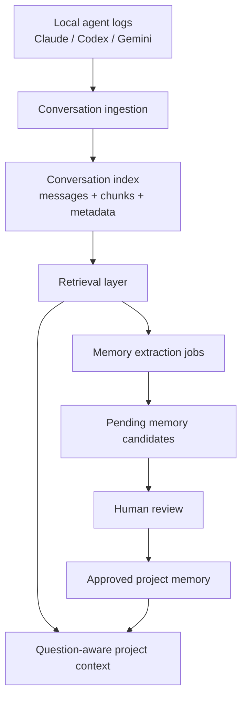

# ChatMem Hybrid Memory Architecture Design

## Goal

把 ChatMem 从“只有已批准记忆才像记得”改造成“本地历史可查、候选提炼可控、长期记忆可信”的混合记忆系统。

目标体验是：

- 用户安装或首次进入项目后，ChatMem 自动发现并索引本地 Claude、Codex、Gemini 历史对话。
- 用户问“你还记得我们讨论过 X 吗”时，agent 能同时检查已批准项目记忆和历史对话证据。
- 历史对话里的信息不会静默变成长期记忆；只有经过用户审核的候选才进入 approved project memory。
- 默认不要求 ChatMem 自己管理模型 API key；提炼候选先走 agent-assisted MCP 流程，未来支持可选后台模型模式。

## Problem Statement

当前实现把几个层次混在了一起：

- `get_repo_memory` 只返回 approved memory，适合启动注入，但不适合回答“历史里是否讨论过”。
- `search_repo_history` 能查历史，但需要 agent 主动想到调用；很多场景下 agent 只看 startup memory，就会说“不记得”。
- 自动抽取器只识别显式标记，例如 `Remember:`、`Rule:`、`Gotcha:`、`Do not`，它不是语义级历史沉淀。
- 对话索引粒度偏粗，当前搜索正文会截取有限消息，长对话后半段可能无法被检索。
- repo 归属存在漂移风险，例如对话被归到 `D:\VSP`，但用户在 `D:\VSP\agentswap-gui` 提问。

结果是：本地明明有大量对话，ChatMem 却表现得像没看过；即使生成了 pending candidates，也不会进入 agent 默认上下文。

## Design Principles

1. **历史可查和长期记忆分开。**
   历史对话是证据资源；approved memory 才是可信、可启动注入的长期上下文。

2. **索引默认自动，记忆升级必须审核。**
   ChatMem 可以自动扫描和索引本地历史，但不能自动批准长期记忆。

3. **agent 默认应该查两层。**
   当用户问回忆、之前讨论、旧决策、旧方案时，agent 不应只读 `get_repo_memory`，还应查询历史证据。

4. **证据链是一等对象。**
   每条候选和每条 approved memory 都应能追溯到 conversation、message、chunk 或文件证据。

5. **先本地可靠，再模型增强。**
   本地索引、FTS、向量、去重、冲突检测应不依赖外部模型；LLM 只负责提炼和改写候选。

## Architecture Overview



The system has four durable layers:

- **Conversation Corpus:** raw normalized conversations and chunks.
- **Retrieval Index:** FTS, vector fallback, provider vectors, entities, repo aliases, timestamps.
- **Candidate Queue:** memory suggestions with evidence, confidence, duplication and conflict metadata.
- **Approved Memory:** human-approved project facts used for startup and future agent guidance.

## Layer 1: Conversation Ingestion

### Responsibilities

The ingestion layer discovers local conversations and keeps them synchronized into ChatMem storage.

It should support:

- Initial scan on first app launch or first ChatMem project visit.
- Incremental scan when new conversations appear or existing logs change.
- Manual “rescan project” action.
- Cross-agent adapters for Claude, Codex, and Gemini.
- Stable source identity: `source_agent`, `source_conversation_id`, storage path, updated time, project dir.

### Repo Attribution

Repo attribution must become explicit and inspectable.

Add or formalize:

- `repos`: canonical repo roots.
- `repo_aliases`: observed roots, parent roots, worktree paths, adapter-specific project ids, Gemini hash paths.
- `conversation_repo_links`: many-to-many links when one conversation may plausibly belong to multiple roots.

Rules:

- Prefer exact canonical git root match.
- If a conversation was started from an ancestor directory, link it to the ancestor and candidate child repos when file changes or message paths mention the child repo.
- If attribution is uncertain, mark confidence and surface it in diagnostics instead of silently hiding the conversation.

This fixes the `D:\VSP` versus `D:\VSP\agentswap-gui` drift.

## Layer 2: Conversation Index

### Chunk-Level Indexing

Current conversation search should move from “conversation body summary” to message/chunk-level documents.

Recommended records:

- `conversation_snapshots`
  - conversation id, source agent, project dir, title, timestamps, storage path.
- `conversation_messages`
  - message id, role, content, timestamp, token estimate, tool call metadata.
- `conversation_chunks`
  - chunk id, conversation id, message ids, chunk text, chunk type, token estimate, ordinal.
- `search_documents`
  - one row per approved memory, candidate, episode, conversation summary, message chunk, wiki page.
- `document_embeddings`
  - local hash fallback plus optional provider embedding side by side.
- `source_spans`
  - normalized evidence references pointing to conversation/message/chunk/file.

Chunk types:

- `user_request`
- `assistant_summary`
- `implementation_detail`
- `tool_output_summary`
- `file_change`
- `handoff_or_checkpoint`
- `memory_marker`

### Indexing Policy

All local conversation text should be searchable, but not all text should become memory candidate input at the same priority.

Index everything useful for retrieval:

- User requests.
- Assistant conclusions and final summaries.
- File paths and commands.
- Tool call names and compact outputs.
- Explicit memory markers.
- Handoff/checkpoint summaries.

Downrank or summarize noisy material:

- Long raw terminal output.
- Repeated dependency install logs.
- Huge generated file contents.
- Stack traces beyond the useful excerpt.

## Layer 3: Retrieval Layer

### Problem With Current Tool Split

`get_repo_memory` is correct as a compact startup tool, but it is not enough for recall. `search_repo_history` exists, yet agent behavior depends on the model remembering to call it.

### New Primary Tool

Add a new MCP tool:

```text
get_project_context(repo_root, query, intent, limit)
```

Inputs:

- `repo_root`: requested project root.
- `query`: user task or recall question.
- `intent`: `startup`, `recall`, `continue_work`, `debug`, `release`, `memory_review`, or `auto`.
- `limit`: optional result budget.

Output:

- `approved_memories`: active, fresh project memories.
- `priority_gotchas`: narrow high-risk memories.
- `recent_handoff`: freshest handoff when relevant.
- `relevant_history`: ranked historical matches with evidence and “not approved memory” labeling.
- `pending_candidates`: related pending candidates, clearly marked as unapproved.
- `repo_diagnostics`: attribution warnings, index freshness, scan coverage.

Behavior:

- For `startup`, keep output compact and memory-first.
- For `recall`, always search history even if approved memory is empty.
- For `continue_work`, combine latest checkpoint/handoff, recent episodes, and relevant chunks.
- For `debug` or `release`, boost commands, gotchas, file paths, CI failures, and prior fixes.

This tool becomes the default agent entry point. Existing tools stay available:

- `get_repo_memory` for compact startup compatibility.
- `search_repo_history` for explicit targeted search.
- `list_memory_candidates` and `list_memory_conflicts` for review.

### User-Facing Recall Semantics

Agent responses should distinguish:

- “I found this in approved project memory.”
- “I found related historical discussion, but it has not been promoted to project memory.”
- “I found a pending candidate that still needs review.”
- “I found no local evidence for this.”

This prevents history evidence from being treated as a durable rule.

## Layer 4: Memory Candidate Extraction

### Existing Auto Extractor

Keep the current explicit marker extractor, but rename its role conceptually:

```text
explicit_marker_extractor
```

It should continue to catch:

- `Remember:`
- `Rule:`
- `Gotcha:`
- `Note:`
- `记住:`
- `规则:`
- `注意:`
- lines beginning with `always`, `must`, `do not`, or `never`

But it should be described as a low-cost marker capture path, not as “the memory extraction system.”

### Agent-Assisted Extraction

Default semantic extraction should be agent-assisted.

Flow:

1. User opens project home or conversation page.
2. User chooses “扫描旧对话” or “提炼当前对话”。
3. App creates an extraction prompt with repo root, scope, source records, storage paths, and candidate rules.
4. Current agent reads relevant local conversation data via ChatMem MCP.
5. Agent calls `create_memory_candidate` for durable facts.
6. App refreshes pending candidates.
7. User reviews, edits, merges, rejects, or snoozes.

Candidate rules:

- Durable and repo-scoped.
- Useful to future agents at startup or during retrieval.
- Evidence-backed.
- No secrets, tokens, credentials, private account details.
- No raw full transcript summaries.
- No temporary task lists or one-off debugging noise unless they encode a recurring gotcha.

### Optional Background LLM Extraction

Add later as an opt-in advanced mode.

Requirements:

- User explicitly configures provider, model, API key, and budget.
- Runs only as queued jobs.
- Creates pending candidates only.
- Shows scanned count, candidate count, duplicate count, conflict count, failures, and cost estimate when available.
- Can be paused, canceled, or limited to selected scopes.

The background path reuses the same candidate schema and review UI as agent-assisted extraction.

## Extraction Jobs

Introduce a durable job table:

```text
memory_extraction_jobs
- job_id
- repo_id
- source: agent_assisted | background_llm | explicit_marker
- scope: current_conversation | recent_project | all_project | search_results | manual_selection
- status: queued | running | waiting_review | completed | failed | canceled
- created_by
- created_at
- started_at
- finished_at
- scanned_conversation_count
- scanned_chunk_count
- created_candidate_count
- duplicate_candidate_count
- conflict_count
- error_summary
- settings_json
```

Agent-assisted jobs can be created by the app before the agent runs, then updated when candidates arrive. Background jobs use the same lifecycle.

## Candidate Review Model

Pending candidates should carry enough information for fast human decisions:

- kind
- title or summary
- value
- why it matters
- confidence
- proposed by
- source job id
- evidence refs
- duplicate suggestion
- conflict suggestion
- freshness risk
- recommended action

Review actions:

- approve
- approve with edit
- merge into existing memory
- reject
- snooze
- mark as noisy pattern

Rejected candidates should not disappear from dedup logic. They should suppress near-identical suggestions unless the evidence is materially newer or stronger.

## UI Design

### Project Home

Project home becomes the control surface for memory and history.

Show:

- Local conversations discovered.
- Indexed conversations.
- Project-linked conversations.
- Search documents / chunks indexed.
- Approved project memory count.
- Pending candidate count.
- Last scan time.
- Attribution warnings.

Primary actions:

- Search history.
- Scan recent conversations.
- Scan all project conversations.
- Review pending memories.
- Rebuild embeddings.
- Rescan local logs.

Example copy:

```text
已发现 2,431 段本地对话
本项目相关 86 段
已索引 84 段
待确认记忆 12 条
已确认项目记忆 4 条
```

### Conversation Page

Selected conversation stays full width.

Actions:

- 提炼成记忆
- 查相似历史
- 创建 checkpoint
- 复制继续提示

Do not restore a persistent memory side panel in the conversation reader.

### Memory Review Modal

The review modal should show:

- Candidate text.
- Why it matters.
- Evidence excerpt.
- Link to source conversation.
- Duplicate or conflict notice.
- Freshness warning.
- Approve/edit/merge/reject/snooze actions.

## MCP And Agent Contract

Update the ChatMem skill after implementation so agents default to:

1. Call `get_project_context` before substantial repo work.
2. If the user asks whether something was discussed before, use recall intent.
3. Treat `approved_memories` as durable context.
4. Treat `relevant_history` as evidence, not policy.
5. Treat `pending_candidates` as unapproved suggestions.
6. Create candidates when the current conversation yields durable project facts.

The skill should stop implying that `get_repo_memory` alone is enough for most recall workflows.

## Data Migration

Migration should be additive:

1. Keep existing approved memories, candidates, episodes, wiki pages, checkpoints, handoffs, runs, and artifacts.
2. Add chunk and source-span tables.
3. Backfill chunks from existing stored messages.
4. Backfill search documents for chunks.
5. Add repo aliases from existing repos and observed conversation project dirs.
6. Rebuild local hash embeddings for new documents.
7. Leave provider embeddings optional and rebuildable.

No approved memory should be rewritten during migration.

## Privacy And Safety

ChatMem remains local-first.

Default behavior:

- Local scan and local index only.
- No cloud upload unless the user explicitly runs WebDAV sync.
- No background model calls unless the user enables a provider.
- No automatic approval of candidates.

Sensitive content handling:

- Candidate creation should reject or warn on likely secrets.
- Search results may show short excerpts, but should avoid dumping long raw transcripts.
- Evidence refs point to source material without forcing the whole transcript into agent context.

## Error Handling

### Index Scan Fails

Show partial results and keep successfully indexed conversations.

Surface:

- failed adapter
- failed path
- error summary
- retry action

### Repo Attribution Is Ambiguous

Show an attribution warning:

```text
部分对话可能属于父目录 D:\VSP。已纳入历史搜索，但不会自动升级为本项目记忆。
```

### Extraction Produces No Candidates

Show:

```text
这次扫描没有发现明显值得长期保留的项目记忆。历史仍然可以搜索。
```

### Background LLM Fails

Keep created candidates, mark job failed, and show resumable state.

## Testing Strategy

### Backend

- First-run scan creates conversation snapshots for available agents.
- Incremental scan skips unchanged conversations and updates changed logs.
- Chunk index includes late-message content beyond the first 12 messages.
- `get_project_context` with recall intent returns history when approved memory is empty.
- `get_project_context` labels pending candidates as unapproved.
- Repo alias matching finds ancestor-root conversations without silently claiming them as exact project memory.
- Candidate approval copies evidence refs into approved memory.
- Rejected candidates suppress repeated near-duplicate suggestions.

### Frontend

- Project home displays scan/index/candidate/memory counts.
- Empty memory state offers history scan and candidate generation, not a dead end.
- Conversation page remains full width and exposes “提炼成记忆”.
- Review modal supports approve, edit, merge, reject, and snooze.
- Recall search UI distinguishes approved memory from historical evidence.

### Integration

- Fresh install with existing local conversations produces searchable history without approved memory.
- User asks about an old topic and receives historical evidence.
- Agent-assisted scan creates pending candidates.
- Approved candidate appears in future `get_project_context` startup output.
- WebDAV sync remains explicit and unaffected by local indexing.

## Rollout Plan

### Phase 1: Reliable Local History

- Add first-run and manual scan.
- Add chunk-level indexing.
- Add repo aliases and attribution diagnostics.
- Add project-home index status.
- Add `get_project_context` recall path.

### Phase 2: Agent-Assisted Memory Seeding

- Merge current memory seeding UI direction.
- Add extraction job records.
- Connect project scan and current conversation prompts to job status.
- Improve pending candidate review flow.
- Update ChatMem skill guidance.

### Phase 3: Optional Background Extraction

- Add provider configuration.
- Add budget and scope controls.
- Add queued background extraction.
- Reuse candidate review and evidence model.

## Non-Goals

This design does not require:

- Automatic approval of project memories.
- Mandatory cloud sync.
- Mandatory built-in model provider.
- Full transcript injection into agent context.
- Replacing existing MCP tools immediately.
- Rewriting existing approved memories during migration.

## Success Criteria

The architecture is successful when:

- A fresh ChatMem install can index thousands of existing local conversations.
- A project with zero approved memories can still answer “did we discuss X before” using historical evidence.
- Approved memory remains small, reviewed, and trustworthy.
- Pending candidates are visible, reviewable, and deduplicated.
- Repo-root drift is diagnosed instead of silently causing missed recall.
- Agent startup behavior no longer feels like memory loss.
