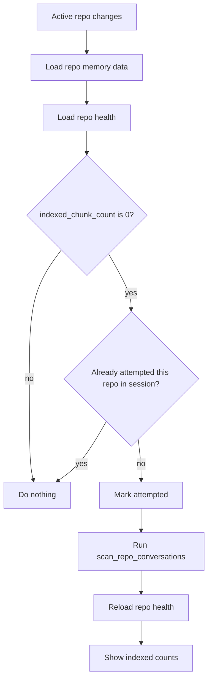

# ChatMem Auto Bootstrap Scan Design

## Goal

Make a freshly installed ChatMem useful on the first project open.

When the user selects a conversation that belongs to a repository with no local history index yet, the app should automatically bootstrap that repository's local conversation index instead of waiting for the user to manually click a scan button.

This is meant to fix the most visible failure mode:

- the repo already has many historical Claude, Codex, or Gemini conversations
- ChatMem has no approved memory yet
- the user asks a recall question
- ChatMem behaves as if nothing was ever discussed because the local history index was never built

## Scope

This design covers one narrow behavior change:

- detect an "empty or effectively empty" local history index for the active repo
- trigger one automatic `scan_repo_conversations(repo_root)` bootstrap run
- refresh repo health after the scan completes
- show lightweight in-place status in the existing project history panel

This design does not add:

- global startup scanning across every repo
- a new background job system
- scan queues, pause, cancel, or scheduling
- automatic candidate extraction
- automatic approval of any memory

## Existing System

The current implementation already has the pieces needed for a bootstrap flow:

- frontend loads repo memory data when `selectedConversation.project_dir` changes
- frontend loads repo diagnostics through `get_repo_memory_health(repo_root)`
- frontend can manually trigger `scan_repo_conversations(repo_root)`
- frontend already shows scan status through `ProjectIndexStatus`
- backend scan logic already normalizes repo roots, attributes conversations, and writes chunk-level index records

The missing piece is orchestration at first use.

## User Experience

### Happy Path

1. User opens the app and selects a conversation in repo `R`.
2. The app loads approved memory, pending candidates, wiki pages, and repo health for `R`.
3. If repo health indicates that the local history index is empty, the app automatically starts a bootstrap scan for `R`.
4. The project history panel shows that local history is being indexed.
5. When the scan finishes, the app reloads repo health.
6. The repo now has searchable local history even if approved memory is still empty.

### Visible Behavior

The user should not need to understand internal memory mechanics.

The UX message is simply:

- "Local history is being indexed"
- then normal counts appear

Manual rescan stays available.

### Failure Behavior

If bootstrap scan fails:

- do not block conversation detail
- do not close the memory drawer
- keep manual rescan available
- log the error as today
- show existing warning or unchanged empty state in the history panel

The failure mode should be "history not yet available", not "the page breaks".

## Bootstrap Eligibility Rules

Automatic bootstrap should run only when all of the following are true:

1. there is an active repo root from the selected conversation
2. repo health has finished loading for that repo
3. no scan is already running for that repo
4. the app has not already attempted bootstrap for that repo in the current session
5. repo health shows that the local history index is effectively empty

### Effective Empty Definition

For phase one, use a conservative rule:

- `indexed_chunk_count === 0`

This is the strongest signal that no searchable local history has been built yet.

Do not trigger bootstrap merely because approved memory is empty. A repo with zero approved memories may still already have a valid local history index.

### Session Deduplication

Add a frontend session-level record of bootstrap attempts keyed by canonical repo root when available, otherwise requested repo root.

This prevents repeated automatic scans when the user:

- re-selects the same conversation
- switches between conversations in the same repo
- opens and closes the memory drawer
- revisits the repo after a failed or completed attempt during the same app session

This deduplication is session-local only. It does not need durable storage.

## Architecture

### Frontend Responsibilities

The frontend owns bootstrap orchestration because the trigger depends on view state:

- active conversation selection
- existing loading lifecycle in `App.tsx`
- current `repoScanRunning` flag
- current `ProjectIndexStatus` component

Add a second effect or post-health decision path in the repo memory loading flow:

1. load repo memory lists as today
2. load repo health as today
3. decide whether bootstrap scan should run
4. if eligible, start scan
5. refresh repo health after scan

This keeps bootstrap behavior close to the current `health -> scan -> refresh` path instead of inventing a second scan system.

### Backend Responsibilities

No new backend command is required for phase one.

Reuse:

- `get_repo_memory_health`
- `scan_repo_conversations`

Backend behavior remains unchanged. The new feature is an application-level policy that decides when to call existing commands automatically.

## State Model

Add one lightweight frontend state/ref:

- `autoBootstrapAttemptedReposRef`

Suggested shape:

```ts
const autoBootstrapAttemptedReposRef = useRef<Record<string, true>>({});
```

This state should not be rendered directly. It only prevents repeated automatic scans.

No new persistent settings are required in phase one.

## Decision Flow



## UI Behavior

Keep the existing `ProjectIndexStatus` component as the primary surface.

### During Bootstrap Scan

Use the existing `scanning` visual state. The user does not need a separate "auto" and "manual" scan distinction in the UI for phase one.

Optional small copy refinement:

- if `loading` is false and `scanning` is true while counts are zero, the panel may say "Scanning..." exactly as it does now

Do not add:

- modal interruptions
- toast requirements
- onboarding wizard
- separate first-run dashboard

## Race and Consistency Rules

The bootstrap path must obey the same repo-staleness protections already used for manual scans.

Rules:

1. Never write refreshed health into state if the active repo changed during the scan.
2. Never start a second bootstrap scan for the same repo while one is already active.
3. Manual rescan during or after bootstrap should still work.
4. If bootstrap starts for repo `A` and the user immediately switches to repo `B`, repo `A` may finish in the background, but only repo `B` should update visible state.

## Edge Cases

### Repo Has Approved Memory But No Chunks

Still auto-bootstrap.

Reason:

- approved memory and searchable local history are different layers
- the repo still lacks history evidence for recall questions

### Repo Has Chunks But Zero Approved Memory

Do not auto-bootstrap.

Reason:

- the main problem is already solved for recall
- lack of approved memory alone is not evidence of missing index

### Repo Health Fails To Load

Do not auto-bootstrap.

Reason:

- bootstrap decision depends on health
- existing behavior already keeps the rest of the memory UI usable when health fails

### Scan Finds Zero Matching Conversations

Do not retry automatically in a loop.

Reason:

- this usually indicates repo attribution mismatch, alias drift, or genuinely no historical data
- repeated retries would only waste startup time

The existing warning path is enough for phase one.

## Testing Strategy

Use TDD.

### Frontend Behavior Tests

Add or extend `MemoryWorkspace` or `App` tests to cover:

1. auto bootstrap runs once when health returns `indexed_chunk_count: 0`
2. auto bootstrap does not run when `indexed_chunk_count > 0`
3. auto bootstrap does not re-run when switching between conversations in the same repo during one session
4. auto bootstrap does not run when health load fails
5. after bootstrap scan resolves, health is reloaded
6. repo switch during an in-flight bootstrap scan does not write stale health into the new repo view

### Regression Goals

Existing manual scan behavior must still pass:

- explicit rescan button triggers scan
- scan state disables button
- health refreshes after scan

### Non-Goals For Tests

Do not add full end-to-end background task tests. This feature is intentionally not a job system.

## Rollout

Phase one implementation should be intentionally small:

1. add a failing test for first-open auto bootstrap
2. implement session-local bootstrap attempt tracking
3. integrate bootstrap decision into the existing repo health load flow
4. verify old manual scan tests still pass

If this proves useful, a later phase can add:

- user setting to disable automatic bootstrap
- global repo discovery and staged background indexing
- richer progress reporting
- bootstrapped candidate extraction suggestions after scan completes

## Success Criteria

This design is successful when:

- a repo with existing local conversations and zero indexed chunks gets searchable history on first open without manual action
- a repo with an existing history index does not incur redundant scans
- the conversation workspace remains responsive during bootstrap
- failed bootstrap does not break the page
- future recall flows can rely on history being available far more often than today
